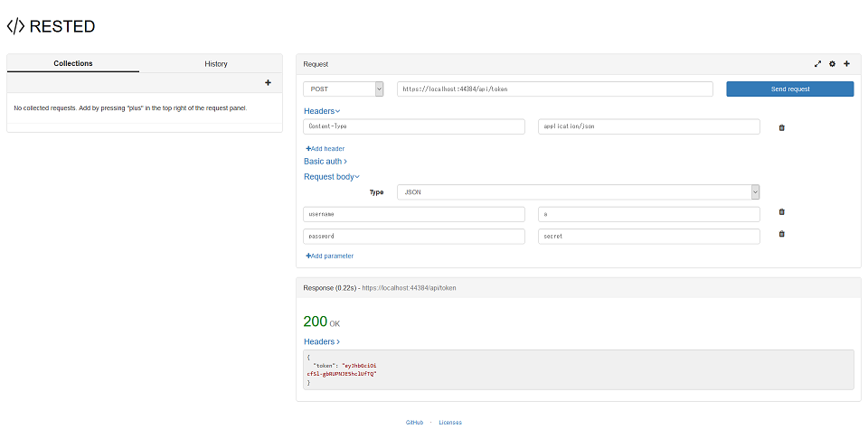
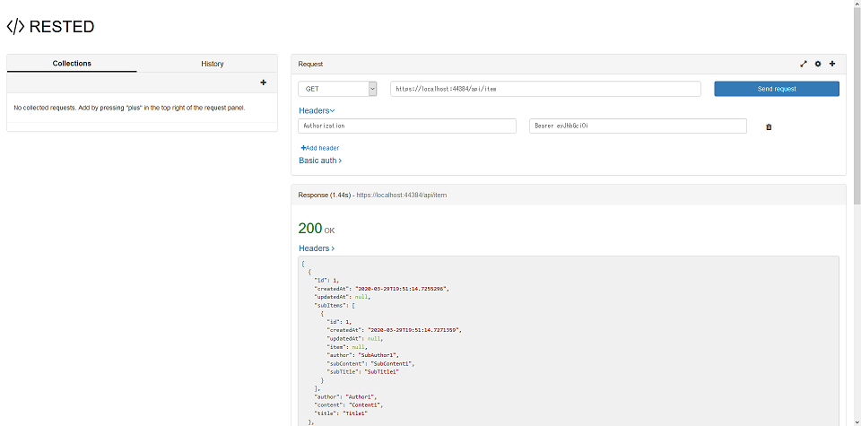

# DotNetCore-RestApi-Sqlite

## Setup

```ps
$ dotnet --version
```

> 3.1.102

```ps
$ dotnet new --help
```

```
使用法: new [options]

オプション:
  -h, --help          Displays help for this command.
  -l, --list          Lists templates containing the specified name. If no name is specified, lists all templates.
  -n, --name          The name for the output being created. If no name is specified, the name of the current directory is used.
  -o, --output        Location to place the generated output.
  -i, --install       Installs a source or a template pack.
  -u, --uninstall     Uninstalls a source or a template pack.
  --nuget-source      Specifies a NuGet source to use during install.
  --type              Filters templates based on available types. Predefined values are "project", "item" or "other".
  --dry-run           Displays a summary of what would happen if the given command line were run if it would result in a template creation.
  --force             Forces content to be generated even if it would change existing files.
  -lang, --language   Filters templates based on language and specifies the language of the template to create.
  --update-check      Check the currently installed template packs for updates.
  --update-apply      Check the currently installed template packs for update, and install the updates.


Templates                                         Short Name               Language          Tags
----------------------------------------------------------------------------------------------------------------------------------
Console Application                               console                  [C#], F#, VB      Common/Console
Class library                                     classlib                 [C#], F#, VB      Common/Library
WPF Application                                   wpf                      [C#]              Common/WPF
WPF Class library                                 wpflib                   [C#]              Common/WPF
WPF Custom Control Library                        wpfcustomcontrollib      [C#]              Common/WPF
WPF User Control Library                          wpfusercontrollib        [C#]              Common/WPF
Windows Forms (WinForms) Application              winforms                 [C#]              Common/WinForms
Windows Forms (WinForms) Class library            winformslib              [C#]              Common/WinForms
Worker Service                                    worker                   [C#]              Common/Worker/Web
Unit Test Project                                 mstest                   [C#], F#, VB      Test/MSTest
NUnit 3 Test Project                              nunit                    [C#], F#, VB      Test/NUnit
NUnit 3 Test Item                                 nunit-test               [C#], F#, VB      Test/NUnit
xUnit Test Project                                xunit                    [C#], F#, VB      Test/xUnit
Razor Component                                   razorcomponent           [C#]              Web/ASP.NET
Razor Page                                        page                     [C#]              Web/ASP.NET
MVC ViewImports                                   viewimports              [C#]              Web/ASP.NET
MVC ViewStart                                     viewstart                [C#]              Web/ASP.NET
Blazor Server App                                 blazorserver             [C#]              Web/Blazor
ASP.NET Core Empty                                web                      [C#], F#          Web/Empty
ASP.NET Core Web App (Model-View-Controller)      mvc                      [C#], F#          Web/MVC
ASP.NET Core Web App                              webapp                   [C#]              Web/MVC/Razor Pages
ASP.NET Core with Angular                         angular                  [C#]              Web/MVC/SPA
ASP.NET Core with React.js                        react                    [C#]              Web/MVC/SPA
ASP.NET Core with React.js and Redux              reactredux               [C#]              Web/MVC/SPA
Razor Class Library                               razorclasslib            [C#]              Web/Razor/Library/Razor Class Library
ASP.NET Core Web API                              webapi                   [C#], F#          Web/WebAPI
dotnet gitignore file                             gitignore                                  Config
global.json file                                  globaljson                                 Config
NuGet Config                                      nugetconfig                                Config
Dotnet local tool manifest file                   tool-manifest                              Config
Web Config                                        webconfig                                  Config
Solution File                                     sln                                        Solution
Protocol Buffer File                              proto                                      Web/gRPC

Examples:
    dotnet new mvc --auth Individual
    dotnet new xunit
    dotnet new --help
```

## APIプロジェクトを作成する

```ps
$ dotnet new webapi
```

> Restore succeeded.

```ps
$ dotnet tool install --global dotnet-aspnet-codegenerator
$ dotnet tool install --global dotnet-ef
```

> 次のコマンドを使用してツールを呼び出せます。dotnet-aspnet-codegenerator
>
> ツール 'dotnet-aspnet-codegenerator' (バージョン '3.1.1') が正常にインストールされました。

> 次のコマンドを使用してツールを呼び出せます。dotnet-ef
>
> ツール 'dotnet-ef' (バージョン '3.1.3') が正常にインストールされました。

```ps
$ dotnet add package Microsoft.EntityFrameworkCore.Design
$ dotnet add package Microsoft.EntityFrameworkCore.Sqlite
```

`Properties\launchSettings.json` から `https://localhost:5001;`を削除する

### 動作確認する

```ps
$ dotnet run
```

[https://localhost:5001/WeatherForecast/](https://localhost:5001/WeatherForecast/) にアクセスし、JSON データが返ることを確認する

## WeatherForecastを削除し独自モデルを追加する

### モデルとコントローラーを修正する

- `- WeatherForecast.cs`
- `+ Models/Item.cs`
- `+ Models/SubItem.cs`

- `- Controllers\WeatherForecastController.cs`
- `+ Controllers\ItemController.cs`

- `+ Models/MyContext.cs`
- `+ appsettings.json`
- `+ Startup.cs`

### マイグレーションファイルを作成する

```ps
$ dotnet ef migrations add Initial
```

> Done. To undo this action, use 'ef migrations remove'

### DB に反映させる

```ps
$ dotnet ef database update
```

> Done.

### Item から SubItem を辿れるようにする

```ps
$ dotnet add package AutoMapper
$ dotnet add package AutoMapper.Extensions.Microsoft.DependencyInjection
```

- `+ DTO/ItemSubItem.cs`
- `+ DTO/MyProfile.cs`

### ItemController を修正する

```cs
    // [Route("[controller]")]
    [Route("api/[controller]")]
```

### SubItemController を追加する

```ps
$ dotnet add package Microsoft.VisualStudio.Web.CodeGeneration.Design
$ dotnet add package Microsoft.EntityFrameworkCore.Design
$ dotnet add package Microsoft.EntityFrameworkCore.SqlServer
$ dotnet tool install --global dotnet-aspnet-codegenerator
$ dotnet aspnet-codegenerator controller -name SubItemController -async -api -m SubItem -dc MyContext -outDir Controllers
```

## フロントエンドを追加する

* wwwroot/*

## JWT認証を追加する

認証に利用する情報を `Controller/TokenController.cs` の `Authenticate()` に記載しているが、本来はDB等から取得する

* `Startup.cs`
* `appsettings.json`
* `Controller/ItemController.cs`
* `Controller/SubItemController.cs`
* `+ Controller/TokenController.cs`

### 動作確認する

```ps
$ dotnet run
```

* POSTで [/api/token](http://localhost:5000/api/token) に `{"username": "a", "password": "secret"}` を送信し、トークンが返ることを確認



* GETで `Authorization: Bearer <取得したトークン>` ヘッダとともに [/api/item](http://localhost:5000/api/item) にアクセスし、Item一覧が返ることを確認



## フロントエンドをJWT認証に対応させる

* wwwroot/*
